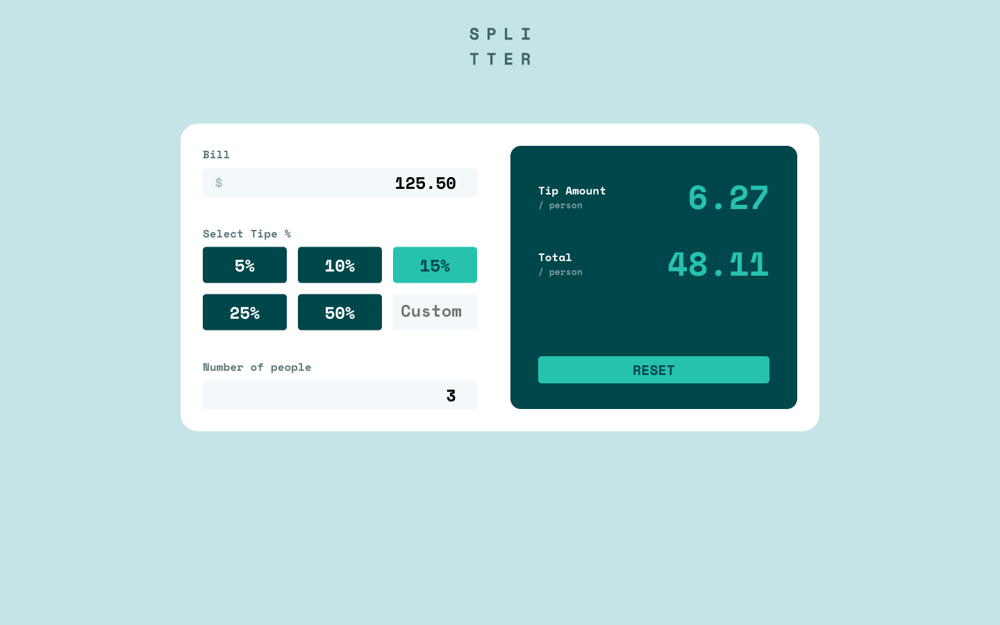

# Tip calculator app

A responsive tip calculator built for the [Frontend Mentor challenge](https://www.frontendmentor.io/challenges/tip-calculator-app-ugJNGbJUX). Enter a bill, choose a preset or custom tip percentage, and see the tip and total per person.

**[Live site](https://tommyk28.github.io/tip-calculator/)**

## Screenshot



## Built with

- Vue 3
- HTML5
- SCSS / CSS
- Vite

## Run locally

You need Git, npm, and a Node.js version supported by `package.json` (`^20.19.0 || >=22.12.0`).

```bash
git clone https://github.com/TommyK28/tip-calculator.git
cd tip-calculator
npm install
npm run dev
```

Open the local URL printed by Vite.

## Available commands

| Command | Description |
| --- | --- |
| `npm run dev` | Start the development server. |
| `npm run build` | Build the app into `dist/`. |
| `npm run preview` | Preview locally after `npm run build`. |
| `npm run lint` | Run linters and apply automatic fixes. |
| `npm run format` | Format files in `src/`. |
